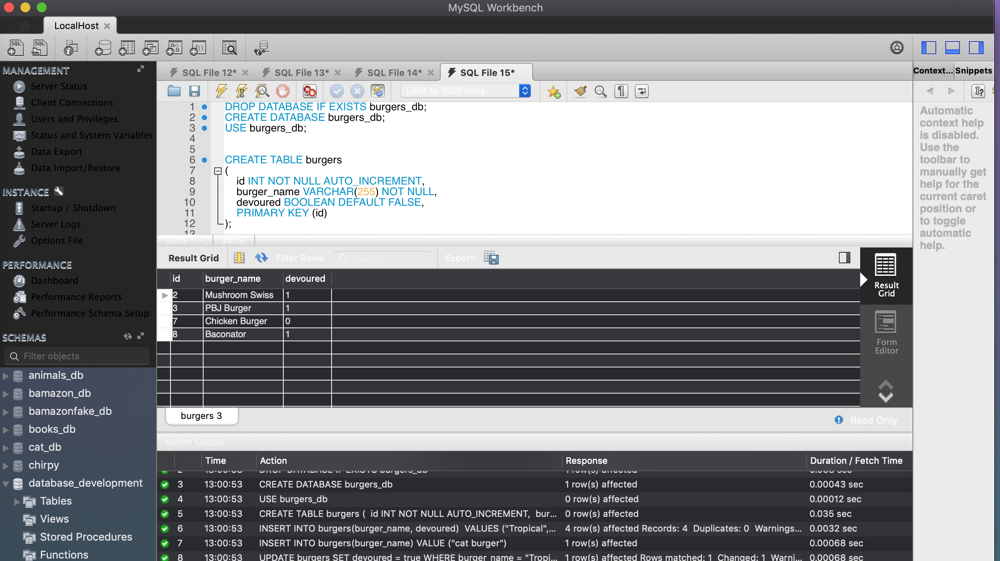

# Burger Eater

### An app designed to create, eat and delete "burgers"

The user is shown a Menu of Burgers that are currently stored in the database:

Then the user may add to the burger menu. All the burgers on the menu have the option to be devoured or deleted. If devoured they are moved to the devoured column. If deleted they are removed from the page and the database.

And now the database after use:

## Technologies Used:

* JavaScript
* HandleBars
* Materialize CSS
* MySQL
* Express.js

## Author: Elisabeth Edrington

[Check out my portfolio](http://elisabethedrington.com)

[Check out the repo](https://github.com/edringtondc/burger-eater/)

